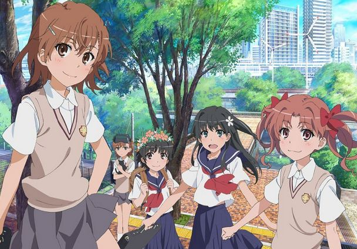
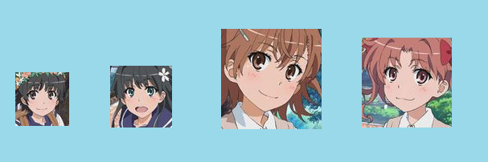
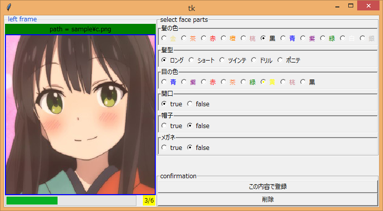
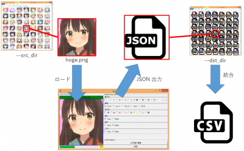
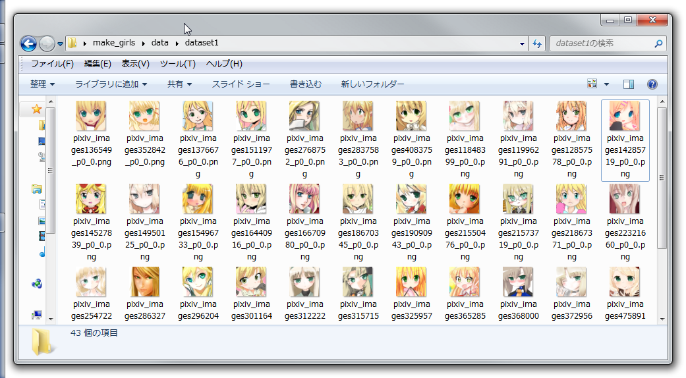

# Arangement-Girls-Domain
女の子の画像どドメインを整理するためのプロジェクトだよ！
<a href="http://make.girls.moe/#/">make.girls.more</a>を参考にしているよ.

プロジェクトの流れ
+ 画像の収集
+ 顔画像の抽出
+ 顔パーツのパラメータ設定

## 画像の収集
wikipediaのアニメ一覧を調べて, yahoo検索から1アニメについて約20の画像をクローリングしておく.
<a href="https://github.com/elasticnet12345/classification-year-of-anime/tree/master/crawler">以前に作ったスクリプト</a>で試してみてね.
あとyahoo検索でアニメの名前を検索するより, pixivをクローリングしたほうが良質な画像が得られることが最近わかった.
<a href="http://www.mathgram.xyz/entry/scraping/pixiv">ココ</a>を参考にして!
データの公開が恐らくダメだと思うので自分でやってくだせえ.

## 顔画像の抽出
画像から顔のみを抽出するよ!
アニメ画像のカスケード分類器は<a href="https://github.com/nagadomi/lbpcascade_animeface">ココ</a>からダウンロードしてね.
```
$ git clone git@github.com:elasticnet12345/make_girls.git
$ cd make_girls/src
$ wget https://raw.githubusercontent.com/nagadomi/lbpcascade_animeface/master/lbpcascade_animeface.xml
$ python face_crop.py 
```
hoge.pngは以下のような画像になっているよ.
<br>
抽出した顔画像は以下のようになっているよ.
5人いるけど4人しか抽出されていないのは一定の大きさ以下は画質が悪いデータを学習データになるべく入れたくないため,
一定のサイズ以下の画像は保存しないようにしているからだよ.
<br>

## 顔パーツのパラメータ設定
<a href="http://make.girls.moe/#/">本家</a>で使われているパラメータのうち, <br>
- 髪の色(金, 茶, 黒, 青, 桃, 紫, 緑, 赤, 銀, 白, 橙)
- 髪型(ロング, ショート, ツインテ, ドリルヘア, ポニテ) 
- 目の色(青, 赤, 茶, 緑, 紫, 黄, 桃, 黒, 橙)
- 開口(ON, OFF)
- 帽子(ON, OFF)
- メガネ(ON, OFF)

顔パーツを登録する操作を単純化するために下のようなGUIを作った(制作途中).
各画像に対して引数--dst_dirで指定したディレクトリにJSONファイルを吐く.
ある程度JSONファイルが溜まったら, CSVに統合しデータベースをつくる.
```
$ python set_label_GUI.py --src_dir=data --dst_dir=json_output
```
<br>
<br>
一通り終わったら, 顔画像が入っているディレクトリとGUIで顔パーツの情報を入力してJSONを作った出力先のディレクトリの2つを以下のようなディレクトリ構成でdata直下に入れる.
GUIの操作が時間がかかるため途中でも後からデータを追加できるので, そのときはコードをいじって!
```sh
make_girl_kit
└ data
  └ dcgan_upload_directory
     ├ face_images 
     |    | hoge.png
     |    | fuga.png
     └ face_images_output
          | hoge.json
          └ fuga.json
```
このJSONをCSVファイルに統合する.
```sh
$ python union.py
```
次に, 学習データセットの作成を行う.
例えば金髪のロングヘアー, 緑目の女の子を生成したいと思ったら, 以下のように実行する.
引数--dataset_directoryは, data直下に今まで追加してきた画像について引数で指定した条件の女の子のみがコピーされる.
```sh
$ python crate_dataset.py --height_size=256 --width_size=256 --hair_color="gold" --hair_type="long" --eye_color="green" --dataset_directory dataset1
```
これを実行すると"data/dataset1"に以下のようなファイルが出力される.
<br>


## 参考
最後は, 適当なGANで自動生成してみてね. CycleGANやStarGANなどを試すと面白い結果になると思うよ！
DCGANでやる場合は例えばこんな感じに動かしてね！
```sh
$ git clone https://github.com/carpedm20/DCGAN-tensorflow.git
$ cd DCGAN-tensorflow
$ mkdir data
$ mv ../make_girl_kit/data/dataset1 ./data/
$ python main.py --input_height 128 --input_width 128 --output_height 48 --output_width 48 --dataset dataset1 --crop --train --epoch 300 --input_fname_pattern "*.png"
```
